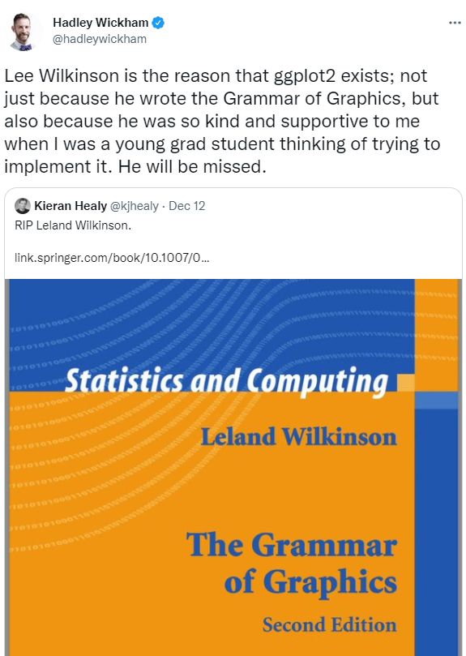
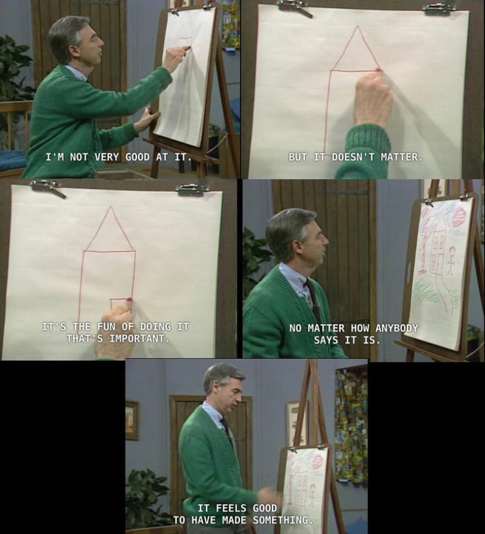

```{r setup, include = FALSE}

options(htmltools.dir.version = FALSE)

library(knitr)

opts_chunk$set(
  #prompt = T,
  fig.align="center", #fig.width=6, fig.height=4.5, 
  # out.width="748px", #out.length="520.75px",
  dpi=300, #fig.path='Figs/',
  cache=T#, echo=F, warning=F, message=F
  )

hook_source <- knitr::knit_hooks$get('source')
knitr::knit_hooks$set(source = function(x, options) {
  x <- stringr::str_replace(x, "^[[:blank:]]?([^*].+?)[[:blank:]]*#<<[[:blank:]]*$", "*\\1")
  hook_source(x, options)
})

```

```{css, echo=FALSE}
/* custom.css */
.left-code {
  color: #777;
  width: 40%;
  height: 92%;
  float: left;
}
.left-code-less {
  color: #777;
  width: 25%;
  height: 92%;
  float: left;
}
.right-plot {
  width: 58%;
  float: right;
  padding-left: 1%;
}
.right-plot-more {
  width: 65%;
  float: right;
  padding-left: 1%;
}
.plot-callout {
  height: 225px;
  width: 450px;
  bottom: 5%;
  right: 5%;
  position: absolute;
  padding: 0px;
  z-index: 100;
}
.plot-callout img {
  width: 100%;
  border: 4px solid #23373B;
}
```

# Outline
<br>
## [Introduction](#intro)

<br>
####Some musings from me about learning data vis in {ggplot2}.

--
<br>
## [We're going to build a plot.](#plot)

<br>
####It will be fun. 

---

class: inverse, center, middle
name: intro

# Introduction

<html><div style='float:left'></div><hr color='#EB811B' size=1px width=796px></html>

---

# What is ggplot2?

.pull-left[
+ The **gg** stands for the [**grammar of graphics**](https://link.springer.com/book/10.1007/0-387-28695-0).

+ **ggplot2** is an R package written by Hadley Wickham, and is an implementation of the book written by Leland Irving.

+ All the cool kids use it. 
]
--
.pull-right[

]
---

# Here's the grammar (in brief ...)

## 1. **Data** - without data, you don't have a plot!

---
count:false
# Here's the grammar (in brief ...)

#### 1. **Data** - without data, you don't have a plot!
## 2. <span style="color:#D24C39">**Mapping**</span> - linking variables to graphical properties.

---
count:false
# Here's the grammar (in brief ...)

#### 1. **Data** - without data, you don't have a plot!
#### 2. <span style="color:#D24C39">**Mapping**</span> - linking variables to graphical properties.
## 3. <span style="color:#268DC7">**Statistics**</span> - compute/transform numbers for us.

---
count:false
# Here's the grammar (in brief ...)

#### 1. **Data** - without data, you don't have a plot!
#### 2. <span style="color:#D24C39">**Mapping**</span> - linking variables to graphical properties.
#### 3. <span style="color:#268DC7">**Statistics**</span> - compute/transform numbers for us.
## 4. <span style="color:#F79A2F">**Scales**</span> - interpret values in data to graphical properties.

---
count:false
# Here's the grammar (in brief ...)

#### 1. **Data** - without data, you don't have a plot!
#### 2. <span style="color:#D24C39">**Mapping**</span> - linking variables to graphical properties.
#### 3. <span style="color:#268DC7">**Statistics**</span> - compute/transform numbers for us.
#### 4. <span style="color:#F79A2F">**Scales**</span> - interpret values in data to graphical properties.
## 5. <span style="color:#86B359">**Geometries**</span> - interpret aesthetics as graphical representations.

---
count:false
# Here's the grammar (in brief ...)

#### 1. **Data** - without data, you don't have a plot!
#### 2. <span style="color:#D24C39">**Mapping**</span> - linking variables to graphical properties.
#### 3. <span style="color:#268DC7">**Statistics**</span> - compute/transform numbers for us.
#### 4. <span style="color:#F79A2F">**Scales**</span> - interpret values in data to graphical properties.
#### 5. <span style="color:#86B359">**Geometries**</span> - interpret aesthetics as graphical representations.
## 6. <span style="color:#FFE784">**Facets**</span> - split plot into panels.

---
count:false
# Here's the grammar (in brief ...)

#### 1. **Data** - without data, you don't have a plot!
#### 2. <span style="color:#D24C39">**Mapping**</span> - linking variables to graphical properties.
#### 3. <span style="color:#268DC7">**Statistics**</span> - compute/transform numbers for us.
#### 4. <span style="color:#F79A2F">**Scales**</span> - interpret values in data to graphical properties.
#### 5. <span style="color:#86B359">**Geometries**</span> - interpret aesthetics as graphical representations.
#### 6. <span style="color:#FFE784">**Facets**</span> - split plot into panels.
## 7. <span style="color:#D03461">**Coordinates**</span> - define physical mapping.

---
count:false
# Here's the grammar (in brief ...)

#### 1. **Data** - without data, you don't have a plot!
#### 2. <span style="color:#D24C39">**Mapping**</span> - linking variables to graphical properties.
#### 3. <span style="color:#268DC7">**Statistics**</span> - compute/transform numbers for us.
#### 4. <span style="color:#F79A2F">**Scales**</span> - interpret values in data to graphical properties.
#### 5. <span style="color:#86B359">**Geometries**</span> - interpret aesthetics as graphical representations.
#### 6. <span style="color:#FFE784">**Facets**</span> - split plot into panels.
#### 7. <span style="color:#D03461">**Coordinates**</span> - define physical mapping.
## 8. <span style="color:#398E9A">**Theme**</span> - what does your plot look like?

---
count:false
# Here's the grammar (in brief ...)

#### 1. **Data** - without data, you don't have a plot!
####2. <span style="color:#D24C39">**Mapping**</span> - linking variables to graphical properties.
#### 3. <span style="color:#268DC7">**Statistics**</span> - compute/transform numbers for us.
#### 4. <span style="color:#F79A2F">**Scales**</span> - interpret values in data to graphical properties.
#### 5. <span style="color:#86B359">**Geometries**</span> - interpret aesthetics as graphical representations.
#### 6. <span style="color:#FFE784">**Facets**</span> - split plot into panels.
#### 7. <span style="color:#D03461">**Coordinates**</span> - define physical mapping.
#### 8. <span style="color:#398E9A">**Theme**</span> - what does your plot look like?

---
# My advice

### Find data you're interested in.

<br>
### Find code for plots you like, then experiment.

---
# My advice

### [You're going to suck.](https://www.youtube.com/watch?v=8SGif63VW6E&t=246s)

--
<br>
<div align="center">

</div>

---
class: inverse, center, middle
name: plot

# Let's plot. 

<html><div style='float:left'></div><hr color='#EB811B' size=1px width=796px></html>

---

# First, a wholesome meme.
<div align="center">


</div>

